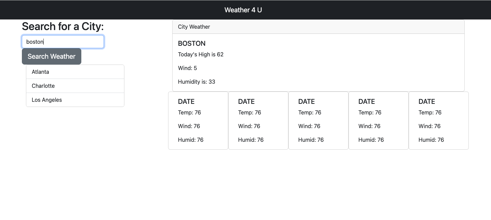

# Weather API App

This is an app that allows a user to search for weather by city. It shows current weather and a 5 day forecast. It also stores the last cities the user searched for. 

[Weather App Link](https://kylezap.github.io/weather-api-app/)

## Technology

I used jQuery for some functionality and Bootstrap for the framework. Otherwise mostly vanilla Javascript.

